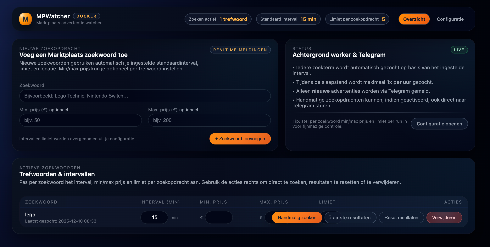

# MPWatcher – Marktplaats Advertentie Watcher

MPWatcher is een Docker-based webapplicatie waarmee je automatisch Marktplaats-advertenties monitort op basis van zoekwoorden en **direct via Telegram meldingen ontvangt** bij nieuwe advertenties.

✅ Webinterface  
✅ Telegram notificaties  
✅ Per zoekwoord instelbaar  
✅ Docker / Portainer / NAS-proof  
✅ Persistente configuratie via volume  

---

## 🚀 Functionaliteit

- Monitor meerdere Marktplaats zoekwoorden  
- Alleen **nieuwe advertenties** worden gemeld  
- Telegram berichten bevatten:
  - Titel
  - Prijs
  - Afbeelding
  - Button met link naar advertentie
- Instelbaar:
  - Zoekinterval  
  - Min. / max. prijs per zoekwoord  
  - Resultaatlimiet per zoekopdracht  
  - Postcode en straal  
  - Nachtmodus (slaapstand)  
- Handmatige zoekactie mogelijk via de GUI  

---

## 📸 Screenshot



---

## 🐳 Installatie (Docker)

MPWatcher is bedoeld om te draaien als Docker container en werkt uitstekend met Portainer en andere Docker-omgevingen.

De container gebruikt één volume voor persistente data:

- `/config` – instellingen, zoekwoorden en resultaten  

Na het starten is de webinterface bereikbaar via de ingestelde poort.


```yaml
version: "3.8"

services:
  mpwatchter:
    image: makooy/mpwatchter:latest
    container_name: mpwatchter
    restart: unless-stopped
    network_mode: bridge
    environment:
      - TZ=Europe/Amsterdam
      - PUID=1000
      - PGID=1000
    ports:
      - "8000:8000"
    volumes:
      - /path/to/mpwatchter-config:/config
```
---

## ⚙️ Configuratie via Web-GUI

Ga in de webinterface naar **Configuratie**.

### 🔁 Zoekinstellingen

- **Standaard interval (minuten)**  
  Wordt gebruikt voor nieuwe zoekwoorden  
- **Limiet per zoekopdracht**  
  Maximaal aantal advertenties per run (1–20)

### 🌙 Slaapstand (nachtmodus)

- Minder vaak zoeken tijdens de nacht  
- Standaard actief tussen **23:00 – 07:00**  
- Maximaal **1 zoekactie per uur** tijdens slaapstand  

### 📍 Locatie-instellingen

- **Postcode** (bijv. `1234AB`)  
- **Straal**
  - 3, 5, 10, 15, 25, 50, 75 km  
  - of *alle afstanden*

---

## 📲 Telegram configuratie

Vul de Telegram gegevens in onder **Configuratie → Telegram**:

- Telegram Bot Token  
- Telegram Chat ID  

Gebruik de knop **“Test Telegram”** om te controleren of alles werkt.

---

## 🔍 Zoekwoorden beheren

Via het **Overzicht** in de GUI:

- Voeg nieuwe zoekwoorden toe  
- Stel per zoekwoord in:
  - Min. prijs  
  - Max. prijs  
  - Limiet per zoekopdracht  
- Beschikbare acties:
  - Handmatig zoeken  
  - Laatste resultaten bekijken  
  - Resultaten resetten  
  - Zoekwoord verwijderen  

✅ Alleen **nieuwe advertenties** worden doorgestuurd  
✅ Duplicaten worden automatisch gefilterd  

---

## 🧪 Handmatig zoeken

- Start direct een zoekactie via de GUI  
- Resultaten verschijnen:
  - in de webinterface  
  - optioneel direct via Telegram  

Handig om nieuwe instellingen te testen.
